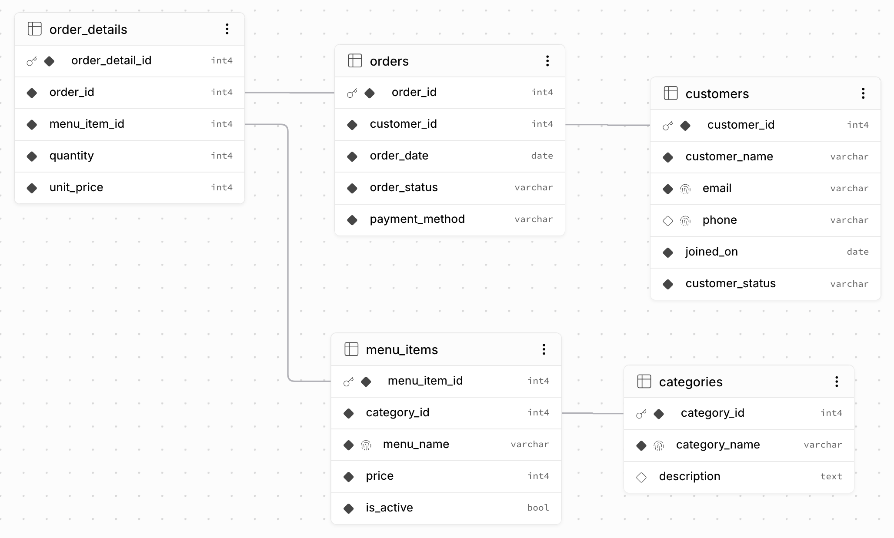

# 🟩 SQL로 만드는 나만의 데이터베이스  

## 🟢 1. 이 프로젝트는 무엇인가  

이 프로젝트는 `PostgreSQL`을 사용해서 카페 주문 데이터베이스를 직접 만들어보는 SQL 실습 프로젝트다.  
목표는 단순히 SQL 문장을 외우는 것이 아니다.  
아래 흐름을 직접 설명할 수 있는 사람이 되는 것이다.  

- 테이블을 왜 나누는지  
- PK와 FK가 무엇인지  
- 고객, 메뉴, 주문, 주문상세가 어떻게 연결되는지  
- 데이터를 넣고, 찾고, 수정하고, 삭제하는 방법  
- JOIN, GROUP BY, 서브쿼리, 인덱스를 왜 쓰는지  

<br><br>

## 🟢 2. 사용 기술  

| 이름 | 풀네임 | 이 프로젝트에서 하는 일 |  
| --- | --- | --- |
| DB | Database | 데이터를 저장하는 공간 |  
| SQL | Structured Query Language | 데이터베이스에 명령을 내리는 언어 |  
| PostgreSQL | PostgreSQL | 실제로 실행할 데이터베이스 |  
| CLI | Command Line Interface | 마우스 대신 터미널 명령어로 작업하는 방식 |  
| Docker | Docker | PostgreSQL을 내 Mac에 직접 설치하지 않고 컨테이너로 실행 |  
| Dockerfile | Dockerfile | Docker 이미지를 만드는 설명서 |  
| Compose | Docker Compose | 여러 Docker 설정을 파일 하나로 실행하는 도구 |  
| YAML | YAML Ain't Markup Language | `compose.yaml` 파일이 사용하는 설정 파일 형식 |  

<br><br>

## 🟢 3. 프로젝트 구조  

```txt
learn_database_basics/  
    README.md  
    compose.yaml  
    docker/  
        Dockerfile  
    docs/  
        requirment.md  
    sql/  
        schema.sql  
        sample.sql  
        queries.sql  
        query_results.md  
```

| 경로 | 역할 |  
| --- | --- |
| `README.md` | 프로젝트 전체 안내서 |  
| `docs/requirment.md` | 과제 요구사항 정리 |  
| `sql/schema.sql` | 테이블 생성 SQL |  
| `sql/sample.sql` | 샘플 데이터 입력 SQL |  
| `sql/queries.sql` | 핵심 쿼리 15개와 보너스 쿼리 |  
| `sql/query_results.md` | 쿼리 실행 결과 기록 |  
| `docker/Dockerfile` | PostgreSQL Docker 이미지 생성 설정 |  
| `compose.yaml` | Docker Compose 실행 설정 |  

<br><br>

## 🟢 4. 데이터베이스 주제  

### 🟡 주제  

카페 주문 데이터베이스  

### 🟡 데이터베이스 구조 (ERD)
 

 
<br><br>
 
### 🟡 테이블  

| 테이블 | 뜻 | 설명 |  
| --- | --- | --- |
| `customers` | 고객 | 카페를 이용하는 사람 |  
| `categories` | 메뉴 분류 | Coffee, Tea, Bakery 같은 분류 |  
| `menu_items` | 메뉴 | 아메리카노, 케이크 같은 실제 판매 상품 |  
| `orders` | 주문 | 고객이 결제한 주문 |  
| `order_details` | 주문 상세 | 한 주문 안에 어떤 메뉴가 몇 개 들어갔는지 |  

### 🟡 관계  

| 관계 | 설명 |  
| --- | --- |
| `categories` 1개 → `menu_items` 여러 개 | 하나의 분류에는 여러 메뉴가 들어갈 수 있다 |  
| `customers` 1명 → `orders` 여러 개 | 한 고객은 여러 번 주문할 수 있다 |  
| `orders` 1개 → `order_details` 여러 개 | 한 주문에는 여러 메뉴가 들어갈 수 있다 |  
| `menu_items` 1개 → `order_details` 여러 개 | 하나의 메뉴는 여러 주문상세에서 반복될 수 있다 |  

<br><br>

## 🟢 5. 먼저 알아야 하는 핵심 단어  

| 단어 | 풀네임 | 쉬운 설명 |  
| --- | --- | --- |
| PK | Primary Key | 한 줄 데이터를 구분하는 대표 번호 |  
| FK | Foreign Key | 다른 테이블의 PK를 가리키는 연결 번호 |  
| CRUD | Create, Read, Update, Delete | 데이터 생성, 조회, 수정, 삭제 |  
| SELECT | Select | 데이터를 조회한다 |  
| INSERT | Insert | 데이터를 넣는다 |  
| UPDATE | Update | 데이터를 수정한다 |  
| DELETE | Delete | 데이터를 삭제한다 |  
| JOIN | Join | 여러 테이블을 연결해서 조회한다 |  
| GROUP BY | Group By | 같은 종류끼리 묶어서 계산한다 |  
| INDEX | Index | 데이터를 더 빨리 찾게 도와주는 찾아보기 표 |  

<br><br>

## 🟢 6. 실행 방법 1: Docker CLI로 하나씩 실습하기  

처음 학습할 때는 이 방법을 먼저 사용한다.  

Dockerfile과 Compose는 마지막에 자동화 도구처럼 확인한다. 처음부터 자동화하면 어떤 일이 일어나는지 보기 어렵다.  

### 🟡 1단계. 현재 폴더 확인  

```bash
pwd  
```

| 명령어 | 풀네임 | 해설 |  
| --- | --- | --- |
| `pwd` | Print Working Directory | 지금 터미널이 어느 폴더를 보고 있는지 출력한다 |  

결과가 아래와 비슷해야 한다.  

```txt
/Users/xxx/ppp/prj/learn_database_basics  
```

<br><br>

### 🟡 2단계. PostgreSQL 이미지 받기  

```bash
docker pull postgres:16  
```

| 명령어 | 풀네임 | 해설 |  
| --- | --- | --- |
| `docker` | Docker | Docker에게 명령을 내린다 |  
| `pull` | Pull | Docker Hub에서 이미지를 내려받는다 |  
| `postgres:16` | PostgreSQL 16 image tag | PostgreSQL 16 버전 이미지를 뜻한다 |  

<br><br>

### 🟡 3단계. PostgreSQL 컨테이너 실행  

```bash
docker run --name cafe-postgres -e POSTGRES_USER=postgres -e POSTGRES_PASSWORD=postgres -e POSTGRES_DB=postgres -p 5432:5432 -v "$(pwd)":/work -d postgres:16  
```

| 명령어 또는 옵션 | 풀네임 | 해설 |  
| --- | --- | --- |
| `run` | Run | 새 컨테이너를 만들고 실행한다 |  
| `--name` | Name | 컨테이너 이름을 정한다 |  
| `-e` | Environment | 컨테이너 안에서 사용할 환경변수를 넣는다 |  
| `POSTGRES_USER` | PostgreSQL User | PostgreSQL 사용자 이름 |  
| `POSTGRES_PASSWORD` | PostgreSQL Password | PostgreSQL 비밀번호 |  
| `POSTGRES_DB` | PostgreSQL Database | 처음 만들 기본 데이터베이스 이름 |  
| `-p` | Publish port | 내 Mac의 포트와 컨테이너 포트를 연결한다 |  
| `5432:5432` | Host port 5432 to container port 5432 | Mac의 5432번 포트를 컨테이너의 5432번 포트로 연결한다 |  
| `-v` | Volume | 내 폴더를 컨테이너 안 폴더와 연결한다 |  
| `"$(pwd)":/work` | Print Working Directory result to `/work` | 현재 프로젝트 폴더를 컨테이너 안의 `/work`로 연결한다 |  
| `-d` | Detached mode | 터미널을 붙잡지 않고 뒤에서 실행한다 |  

<br><br>

### 🟡 4단계. 컨테이너가 실행 중인지 확인  

```bash
docker ps  
```

| 명령어 | 풀네임 | 해설 |  
| --- | --- | --- |
| `ps` | Process Status | 실행 중인 컨테이너 목록을 보여준다 |  

`cafe-postgres`가 보이면 정상이다.  

<br><br>

### 🟡 5단계. 컨테이너 안으로 들어가기  

```bash
docker exec -it cafe-postgres bash  
```

| 명령어 또는 옵션 | 풀네임 | 해설 |  
| --- | --- | --- |
| `exec` | Execute | 이미 실행 중인 컨테이너 안에서 명령을 실행한다 |  
| `-i` | Interactive | 입력을 받을 수 있게 한다 |  
| `-t` | TTY, Teletypewriter | 터미널 화면처럼 사용할 수 있게 한다 |  
| `bash` | Bourne Again Shell | 컨테이너 안에서 사용하는 명령어 입력 프로그램 |  

<br><br>

### 🟡 6단계. 실습용 데이터베이스 만들기  

컨테이너 안에서 실행한다.  

```bash
createdb -U postgres cafe_order_db  
```

| 명령어 또는 옵션 | 풀네임 | 해설 |  
| --- | --- | --- |
| `createdb` | Create Database | 새 PostgreSQL 데이터베이스를 만든다 |  
| `-U` | User | 어떤 사용자로 실행할지 정한다 |  
| `cafe_order_db` | Cafe Order Database | 이번 실습에서 사용할 데이터베이스 이름 |  

<br><br>

### 🟡 7단계. PostgreSQL CLI 접속  

컨테이너 안에서 실행한다.  

```bash
psql -U postgres -d cafe_order_db  
```

| 명령어 또는 옵션 | 풀네임 | 해설 |  
| --- | --- | --- |
| `psql` | PostgreSQL Interactive Terminal | PostgreSQL에 SQL을 입력하는 CLI 도구 |  
| `-U` | User | 접속할 사용자 이름을 정한다 |  
| `-d` | Database | 접속할 데이터베이스 이름을 정한다 |  

<br><br>

### 🟡 8단계. SQL 파일 실행  

`psql` 안에서 아래 순서대로 실행한다.  

```sql
\i /work/sql/schema.sql  
\i /work/sql/sample.sql  
\i /work/sql/queries.sql  
```

| 명령어 | 풀네임 | 해설 |  
| --- | --- | --- |
| `\i` | Include file | SQL 파일을 읽어서 실행한다 |  
| `schema.sql` | Schema SQL | 테이블 구조를 만든다 |  
| `sample.sql` | Sample SQL | 연습용 데이터를 넣는다 |  
| `queries.sql` | Queries SQL | 핵심 조회, 조인, 집계, 수정, 삭제 쿼리를 실행한다 |  

<br><br>

### 🟡 9단계. PostgreSQL CLI 종료  

```sql
\q  
```

| 명령어 | 풀네임 | 해설 |  
| --- | --- | --- |
| `\q` | Quit | `psql`을 종료한다 |  

<br><br>

### 🟡 10단계. 컨테이너 정리  

```bash
docker stop cafe-postgres  
docker rm cafe-postgres  
```

| 명령어 | 풀네임 | 해설 |  
| --- | --- | --- |
| `stop` | Stop | 실행 중인 컨테이너를 멈춘다 |  
| `rm` | Remove | 멈춘 컨테이너를 삭제한다 |  

<br><br>

## 🟢 7. 실행 방법 2: 마지막에 Dockerfile과 Compose로 실행하기  

`docker/Dockerfile`과 `compose.yaml`은 같은 PostgreSQL 환경을 더 짧은 명령으로 실행하기 위한 파일이다.  

```bash
docker compose up --build -d  
```

| 명령어 또는 옵션 | 풀네임 | 해설 |  
| --- | --- | --- |
| `compose` | Docker Compose | `compose.yaml`을 읽어서 컨테이너를 실행한다 |  
| `up` | Up | Compose 설정에 있는 서비스를 만들고 실행한다 |  
| `--build` | Build | Dockerfile을 다시 읽어서 이미지를 만든다 |  
| `-d` | Detached mode | 컨테이너를 뒤에서 실행한다 |  

컨테이너 접속은 동일하다.  

```bash
docker exec -it cafe-postgres bash  
psql -U postgres -d postgres  
```

Compose 방식은 기본 데이터베이스 이름이 `postgres`다. `cafe_order_db`를 쓰고 싶으면 아래처럼 한 번 만든다.  

```sql
CREATE DATABASE cafe_order_db;  
```

그 다음 다시 접속한다.  

```bash
psql -U postgres -d cafe_order_db  
```

<br><br>

## 🟢 8. SQL 파일 실행 순서  

| 순서 | 파일 | 실행 이유 |  
| --- | --- | --- |
| 1 | `sql/schema.sql` | 테이블과 제약조건을 먼저 만든다 |  
| 2 | `sql/sample.sql` | 테이블 안에 샘플 데이터를 넣는다 |  
| 3 | `sql/queries.sql` | 넣은 데이터를 조회하고 분석한다 |  
| 4 | `sql/query_results.md` | 실행 결과를 확인한다 |  

이 순서가 중요하다.  

테이블이 없으면 데이터를 넣을 수 없다. 데이터가 없으면 조회 결과도 없다.  


<br><br>

## 🟢 9. 완료 기준  

아래를 할 수 있으면 이 프로젝트의 핵심 목표는 끝난 것이다.  

- `docker run`으로 PostgreSQL 컨테이너를 실행할 수 있다  
- `psql`로 PostgreSQL에 접속할 수 있다  
- `schema.sql`로 테이블을 만들 수 있다  
- `sample.sql`로 데이터를 넣을 수 있다  
- `queries.sql`의 15개 핵심 쿼리를 실행할 수 있다  
- `customers`, `orders`, `order_details`가 FK로 연결되는 이유를 설명할 수 있다  
- `INNER JOIN`과 `LEFT JOIN`의 차이를 말할 수 있다  
- `GROUP BY`로 주문 수, 판매 수량, 매출을 계산할 수 있다  
- Dockerfile과 Compose가 반복 실행을 쉽게 만드는 도구라는 것을 설명할 수 있다  
